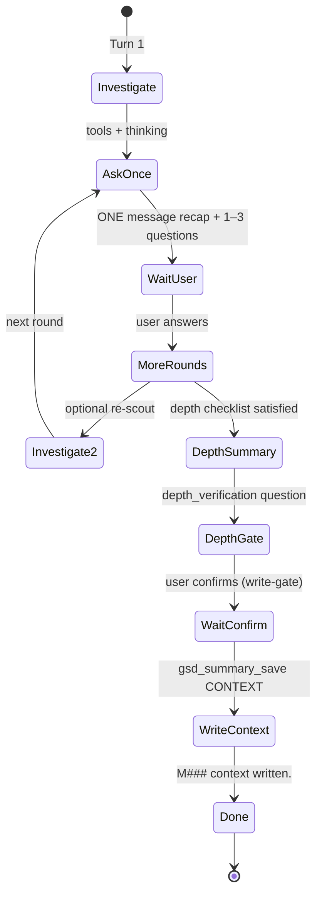
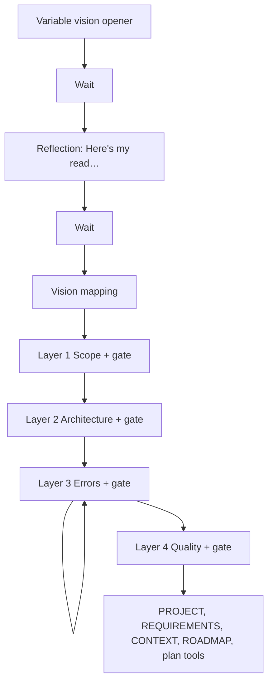
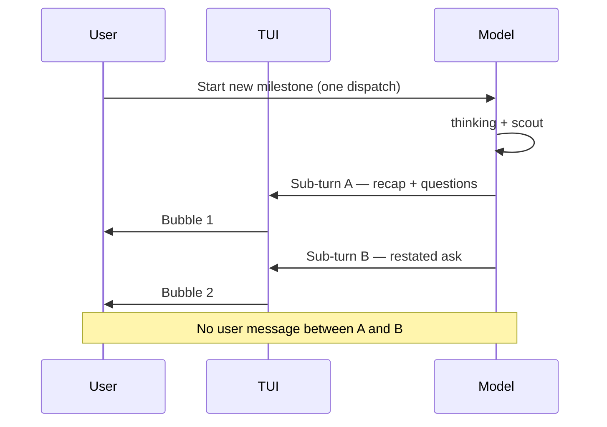
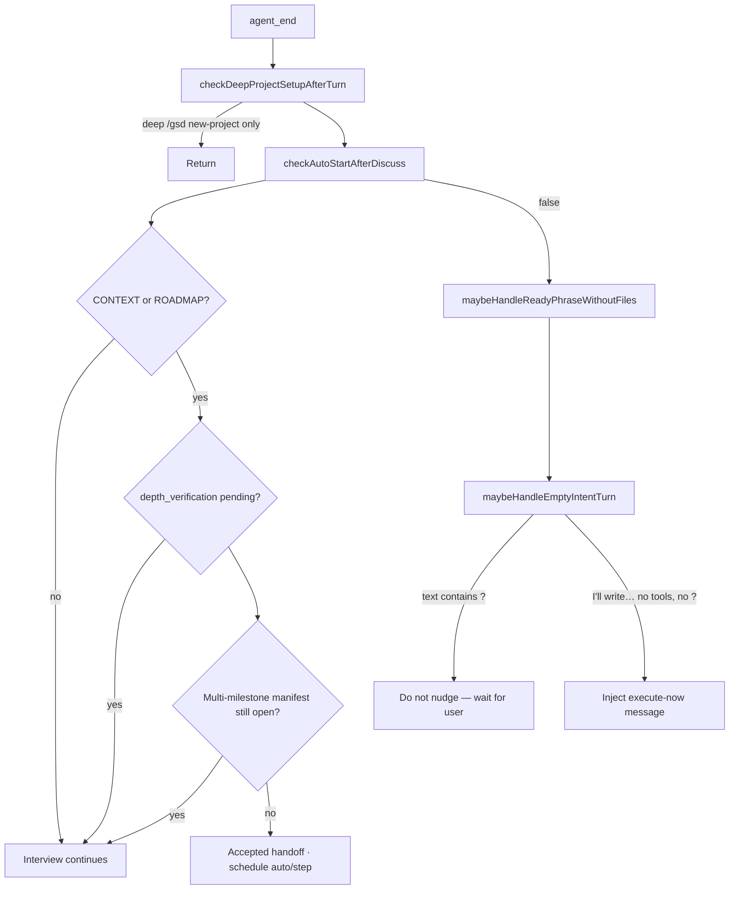

# New milestone discuss flow

Reference for how GSD routes and runs milestone discussion when the user starts a new milestone (e.g. M006 on an established todo app). Use this while testing double-message / early-stop regressions.

## Entry points

All paths eventually call `launchNextMilestoneDiscuss()` or `dispatchNewMilestoneDiscuss()` in `src/resources/extensions/gsd/guided-flow.ts`.

| Entry | Handler |
|-------|---------|
| `/gsd` → Start new milestone | `showSmartEntry` → `dispatchNewMilestoneDiscuss` |
| All milestones complete → Start new milestone | `launchNextMilestoneDiscuss` |
| Skip / discard → create new milestone | `dispatchNewMilestoneDiscuss` |
| Requirements backlog → new milestone | `launchNextMilestoneDiscuss({ mapRequirementsBacklog: true })` |

Flow:

1. `nextMilestoneIdReserved()` → e.g. `M006`
2. `setPendingAutoStart(basePath, { milestoneId, step })` (except when backlog path sets it earlier)
3. Branch on backlog and greenfield vs established

```mermaid
flowchart TD
  entry["User: Start new milestone"] --> LM["launchNextMilestoneDiscuss()"]
  LM --> RID["nextMilestoneIdReserved()"]
  LM --> BL{Unmapped requirements backlog?}

  BL -->|yes| BACK["dispatchDiscussForNextMilestoneWithBacklog()"]
  BACK --> P1["guided-discuss-milestone.md + backlog block"]

  BL -->|no| DNM["dispatchNewMilestoneDiscuss()"]
  DNM --> GF{findMilestoneIds().length === 0?}

  GF -->|yes — greenfield| PREP1["runPreparation (optional)"]
  PREP1 --> P2["discuss.md"]
  P2 --> WF1["dispatchWorkflow · gsd-run"]

  GF -->|no — established project| PREP2["runPreparation (optional, milestone mode)"]
  PREP2 --> P3["guided-discuss-milestone.md"]
  P3 --> WF2["dispatchWorkflow · gsd-discuss"]

  DNM --> PAS["setPendingAutoStart(M###)"]
  BACK --> PAS
```

## Prompt routing

| Condition | Template | `customType` | Produces |
|-----------|----------|--------------|----------|
| No milestone dirs on disk | `prompts/discuss.md` | `gsd-run` | Vision, reflection, layers 1–4, PROJECT/REQUIREMENTS/CONTEXT/ROADMAP |
| ≥1 milestone dir exists | `prompts/guided-discuss-milestone.md` | `gsd-discuss` | Interview → `M###-CONTEXT.md` only |
| Unmapped requirements backlog | `guided-discuss-milestone.md` + backlog context | `gsd-discuss` | Same + requirement mapping |

Implementation: `dispatchNewMilestoneDiscuss()` in `guided-flow.ts`.

Preparation (`discuss_preparation`, default on) injects `## Preparation Context` after the prompt:

- **Greenfield:** background only; ask what the user wants to build first.
- **Milestone:** one message after investigation (short recap + 1–3 questions), then stop; no feature-menu dump.

## Single dispatch payload

Each start sends **one** `pi.sendMessage({ triggerTurn: true })` via `dispatchWorkflow()`:

```
GSD-WORKFLOW.md excerpt
## Your Task
<prompt body>
```

Tools are scoped to the discuss allowlist for `discuss-milestone` (see `DISCUSS_TOOLS_ALLOWLIST` in `guided-flow.ts`).

**Re-dispatch guard:** If `hasPendingAutoStart(basePath)` and discussion is still in flight, `showSmartEntry` returns early (“Discussion already in progress”) unless the pending entry is stale (>30s, no CONTEXT/ROADMAP/manifest).

**Finished-but-unconsumed recovery:** Before dead-ending, the guard checks for a discussion that already produced CONTEXT but whose `agent_end` handoff never consumed the entry. When `milestoneHasContext && !isAgentTurnInFlight(ctx)`, `showSmartEntry` clears a stale depth gate belonging to the entry's own milestone (`extractDepthVerificationMilestoneId(pendingGateId) === entry.milestoneId`) and re-runs `checkAutoStartAfterDiscuss(basePath)`, returning if the handoff now accepts. CONTEXT can only be written through a verified depth gate, so a gate still pending for that milestone is provably stale. This recovers the external-engine post-hoc gate clobber: on claude-code-cli, pi ingests the SDK turn's tool blocks after the workflow MCP child already verified the gate and allowed the CONTEXT save, so the `tool_execution_start` hook can re-arm the gate post-hoc and wipe the verification, blocking the handoff silently. The clobber itself is now prevented in `bootstrap/register-hooks.ts` (the re-arm is skipped when the snapshot already records the gate as verified); this guard is the recovery path for a milestone left stuck by a pre-fix clobber.

`/clear` and `/new` destroy the conversation holding the interview, so its pending handoff can never be answered. The `session_switch` hook (`bootstrap/register-hooks.ts`) calls `clearPendingAutoStart(basePath)` when `event.reason === "new"`, deterministically removing the entry — without this, a discussion interrupted **after** its CONTEXT file was written stays pinned forever (the >30s staleness heuristic requires CONTEXT to be absent), dead-ending every later `/gsd` on “Discussion already in progress”. `reason === "resume"` keeps the entry because the restored transcript still contains the question. Auto-mode’s own `newSession()` calls are unaffected: the handoff consumes the entry on `agent_end` before any dispatch.

## Established project interview (intended)

Applies when M001+ already exist (typical “Start new milestone” after shipping work).



| Step | Prompt section | Wait for user? |
|------|----------------|----------------|
| Investigate | Before your first question round | No (tools) |
| First ask | Question rounds + Single user-facing message | **Yes** |
| More rounds | After each answer | **Yes** |
| Depth check | Depth Verification | **Yes** (blocks CONTEXT write) |
| Write | Output | Turn ends |

**Not used on this path:** `discuss.md` vision, reflection (“Here’s my read”), Layer 1–4 gates, multi-artifact project bootstrap.

## Greenfield interview (first milestone ever)

Only when `findMilestoneIds(basePath).length === 0`:



Prompt hardening in `discuss.md`: the first opener is selected from conversational variants, preamble is not vision input, and the turn ends after reflection before Layer 1 questions.

## Double-bubble failure mode (UI)

Symptom: two assistant messages at the same timestamp, second message restates the first ask (“what do you want M006 to be?”).

**Not** a second `dispatchWorkflow`. Claude Code can emit **multiple text sub-turns** in one assistant lifecycle; `packages/gsd-agent-modes/src/modes/interactive/controllers/chat-controller.ts` renders each sub-turn as a separate transcript rail when `content.length` shrinks between sub-turns.



Mitigations:

1. **Routing** — established projects use `guided-discuss-milestone.md` (no reflection block).
2. **Prompt** — “Single user-facing message” in `guided-discuss-milestone.md`; milestone prep guidance in `buildDiscussPreparationContext(..., "milestone")`.
3. **Runtime (TUI)** — `chat-controller.ts` drops redundant follow-up prose via `isRedundantDiscussRestatement()`:
   - **Same timestamp:** second text sub-turn inside one assistant lifecycle (content[] shrink).
   - **Different timestamps:** second assistant message after tool results in the same prompt (text → tools → restated ask); compares against the prior assistant row in `session.messages`.

## After each agent turn (`handleAgentEnd`)

`src/resources/extensions/gsd/bootstrap/agent-end-recovery.ts` — relevant when `pendingAutoStart` is set:



First interview message ending with `?` should **not** trigger empty-turn nudge (`maybeHandleEmptyIntentTurn` in `guided-flow.ts`).

## After CONTEXT is written

1. `M###-CONTEXT.md` on disk (+ depth gate cleared)
2. User or auto resumes the planning pipeline: `research-milestone` if needed, then `plan-milestone`, which persists Slices and renders `M###-ROADMAP.md`.
3. Slice execution / auto-mode

`checkAutoStartAfterDiscuss` clears `pendingAutoStart` and may call `scheduleAutoStartAfterIdle` when artifacts and gates pass. Single-milestone handoff needs context plus a cleared depth gate; multi-milestone discussion still waits for manifest gates.

The user-facing handoff should describe context capture and planning continuation, not imply the Milestone is fully planned or execution-ready. The model-facing ready phrase remains a prompt contract for post-write detection.

Runtime handoff rules:

- Generic `unregistered-milestone` drift still fails closed; runtime reconciliation must not import arbitrary markdown-only milestones into the DB.
- A matching `pendingAutoStart` entry, the pinned `entry.scope.contextFile()`, and a cleared depth gate prove the in-flight milestone was just reserved. If the DB row is missing, guided-flow may insert the minimal queued row, log the repair, and continue in the same check.
- Staleness is artifact-based once context exists. No manifest, no context, no roadmap, plus an expired short timeout may be cleared as interrupted; pinned context remains a legitimate handoff until it progresses or is explicitly cleared.
- Context capture does not promote the stored milestone row to `active`. The durable row may remain `queued` until `plan-milestone` persists Slices; `queued` plus pinned context plus no Slices is interpreted as **Discussion Complete, Planning Pending**, not execution-ready.
- Gate 1b treats `queued` plus pinned context plus a cleared depth gate as normal handoff, not a plan-blocked failure. It must not warn the user about `queued`, inject a hidden `gsd_plan_milestone` retry, or wait for another model turn.
- Remove the old `planBlockedRecoveryCount` behavior. Only failed missing-row repair needs a bounded counter; normal `queued` plus context proceeds without a cap.
- Split success copy by executable plan state. Context-only handoff says `Milestone M### context captured. Continuing the planning pipeline.`; `Milestone M### ready.` requires persisted Slice rows in DB mode or parsed non-empty roadmap Slices in file-only mode.
- Context-only handoff schedules the next auto/step tick; it does not directly dispatch `plan-milestone`. The dispatch resolver chooses `research-milestone` or `plan-milestone`.
- `startAuto: false` only suppresses scheduling. The accepted handoff still clears `pendingAutoStart` and uses the artifact-appropriate success copy.

## Test checklist

| Expect | Established (M006+) |
|--------|---------------------|
| Template | `guided-discuss-milestone` |
| First visible output | One bubble: short recap + 1–3 questions |
| No duplicate ask | No second bubble restating the same question |
| No reflection | No “Here’s my read” / vision sizing |
| User reply | New turn with follow-up questions or depth check |
| CONTEXT | Only after `depth_verification_M###_confirm` |
| Queued + context | Context-captured success, no hidden `gsd_plan_milestone` retry |
| Missing DB row + context | Insert minimal queued row, then same context-captured success |
| Wrong milestone pending gate | Does not block the current milestone handoff |
| CONTEXT written + stale depth gate, no live turn | Recovered: clears the milestone's gate and re-runs the handoff instead of "Discussion already in progress" |

If two bubbles share one timestamp → model sub-turn (prompt compliance). If two timestamps → check for second `/gsd` dispatch or `agent_end` nudge.

## Key files

| File | Role |
|------|------|
| `src/resources/extensions/gsd/guided-flow.ts` | `dispatchNewMilestoneDiscuss`, `launchNextMilestoneDiscuss`, `dispatchWorkflow`, `checkAutoStartAfterDiscuss` |
| `src/resources/extensions/gsd/prompts/guided-discuss-milestone.md` | Established milestone interview |
| `src/resources/extensions/gsd/prompts/discuss.md` | Greenfield bootstrap discuss |
| `src/resources/extensions/gsd/bootstrap/agent-end-recovery.ts` | Post-turn guards |
| `src/resources/extensions/gsd/bootstrap/register-hooks.ts` | `session_switch` clears `pendingAutoStart` on `/clear`/`/new`; `tool_execution_start` skips re-arming an already-verified depth gate (external-engine post-hoc clobber); `tool_result` falls back to `result.structuredContent` for relayed MCP gate answers |
| `packages/gsd-agent-modes/.../chat-controller.ts` | Sub-turn → multiple UI segments |
| `src/resources/extensions/gsd/tests/new-milestone-discuss-routing.test.ts` | Routing regression tests |
| `src/resources/extensions/gsd/tests/register-hooks-depth-verification.test.ts` | Post-hoc gate replay: re-arm skip + `structuredContent` fallback |
| `src/resources/extensions/gsd/tests/clear-stale-autostart.test.ts` | Finished-but-unconsumed discussion recovery branch |

## Related regressions

- **Original bug:** Subsequent milestones used `discuss.md` → vision + reflection + questions in quick succession.
- **#4573:** `maybeHandleEmptyIntentTurn` / `maybeHandleReadyPhraseWithoutFiles` on `agent_end`.
- **#5187:** Question + conditional intent on same line must not auto-nudge.
- **chat-controller #4144:** Sub-turn segment reset when `content.length` shrinks.
